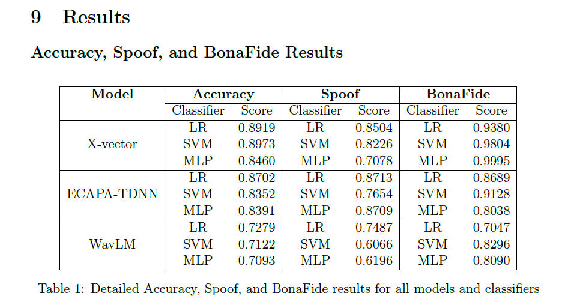
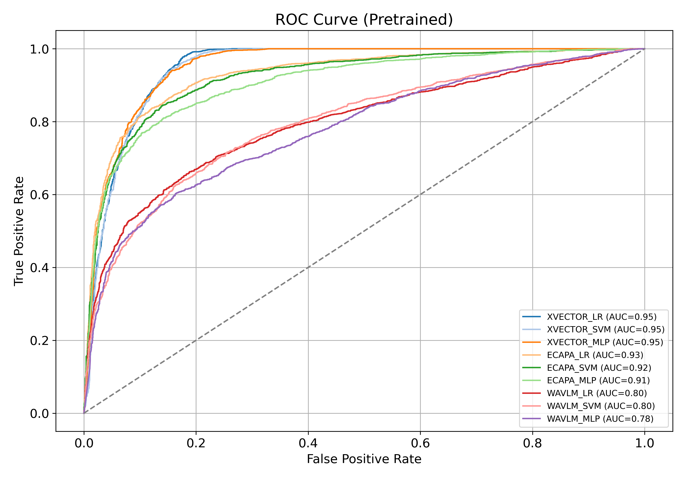
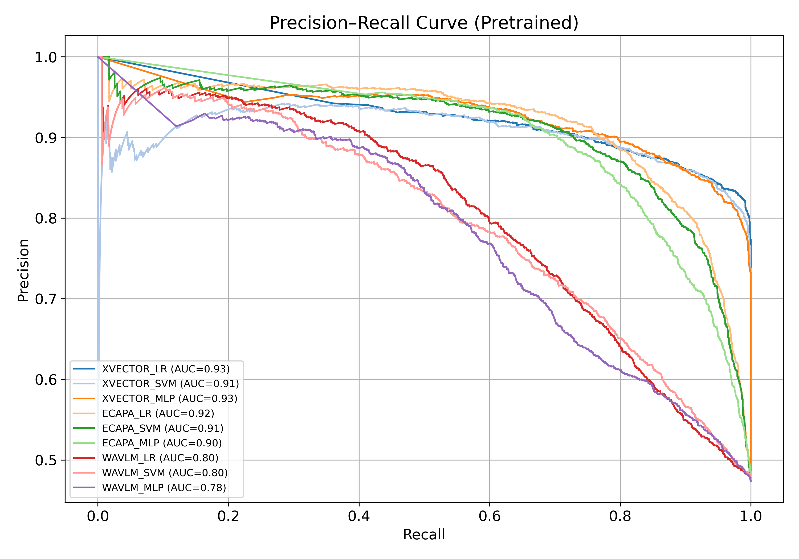
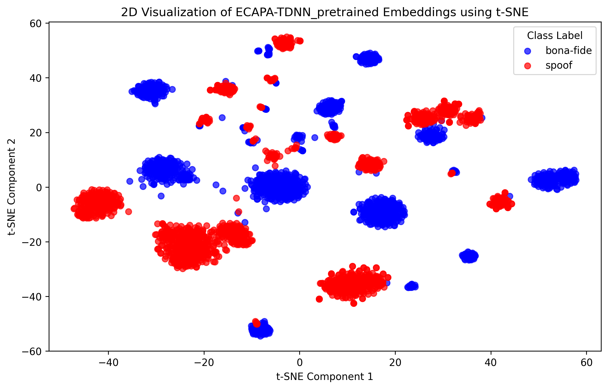

# Deep Speaker Embeddings for Robust Detection of Deepfake Speech

## 🌐 Overview

DeepfakeShield is a machine learning project aimed at detecting deepfake (AI-generated) speech using pre-trained speaker embedding models and traditional classifiers. This is crucial for ensuring the reliability of forensic voice comparison systems and protecting against synthetic voice fraud.

## 📁 Dataset

We used an **in-the-wild dataset** containing both bona fide (real) and spoofed (synthetic) speech samples. This ensured the evaluation covered realistic and diverse audio conditions, which are critical in forensic settings.

## 🧑‍💻 Methods

### 🔊 Speaker Embeddings:

* **X-Vector** \[5]
* **ECAPA-TDNN** \[3]
* **WavLM**

Embeddings were extracted using the **SpeechBrain** toolkit.

### 🎓 Classifiers:

* Logistic Regression
* Support Vector Machine (SVM)
* Multi-Layer Perceptron (MLP)

We tested the impact of scaling, fine-tuning, and model combinations.

## ⚖️ Evaluation Metrics

* **Accuracy**
* **Precision**
* **Recall**
* **F1 Score**

These helped us compare models' ability to distinguish between spoofed and genuine speech.

## 📊 Visualizations

### 1. Result Table: Classifier Accuracy by Model

* Shows that **X-vector + SVM** achieved highest accuracy (89.73%)

### 2. ROC Curve

* X-vector and ECAPA models show strong AUC scores for binary classification.

### 3. Precision-Recall Curve

* Demonstrates class imbalance handling and classifier sensitivity.

### 4. Confusion Matrices

* For each model + classifier combination (X-vector, WavLM, ECAPA-TDNN)
* Highlights false positives/negatives and best performing combinations

### 5. t-SNE Embedding Visualizations

* **X-vector**: Best separation between spoof and bona fide classes
* **ECAPA-TDNN**: Moderate clustering with minor overlaps
* **WavLM**: High overlap, less effective in distinguishing classes

## 🌐 Dashboard

Built using **FastAPI**, **React**, **TailwindCSS**, and **Chart.js**. Features:

* Sections: Problem, Solution, Results, About Me
* Interactive charts
* Animated UI for professional presentation

## 🚀 Conclusion

* X-vector embeddings with SVM classifier delivered the best performance.
* t-SNE plots confirm strong class separation with X-vector and ECAPA-TDNN.
* Future work can include testing on multilingual datasets and improving WavLM through fine-tuning.

## 📄 References

1. Nicolas Müller et al. (2022). *Does audio deepfake detection generalize?* Interspeech.
2. Liu et al. (2019). *Adversarial attacks on spoofing countermeasures*. arXiv:1912.00423.
3. Desplanques et al. (2020). *ECAPA-TDNN*. Interspeech. [https://arxiv.org/abs/2005.07143](https://arxiv.org/abs/2005.07143)
4. Reynolds et al. (2000). *Speaker verification using adapted GMM*. Digital Signal Processing.
5. *Robust DNN embeddings for speaker recognition*. ICASSP 2018.
6. Yamagishi et al. (2021). *ASVspoof 2021 Challenge*. arXiv:2109.00537
7. Cortes & Vapnik (1995). *Support-vector networks*. Machine Learning.
8. Todisco et al. (2017). *Constant Q cepstral coefficients*. Computer Speech & Language.
9. Cover & Hart (1967). *Nearest neighbor pattern classification*. IEEE Trans. on Info Theory.

